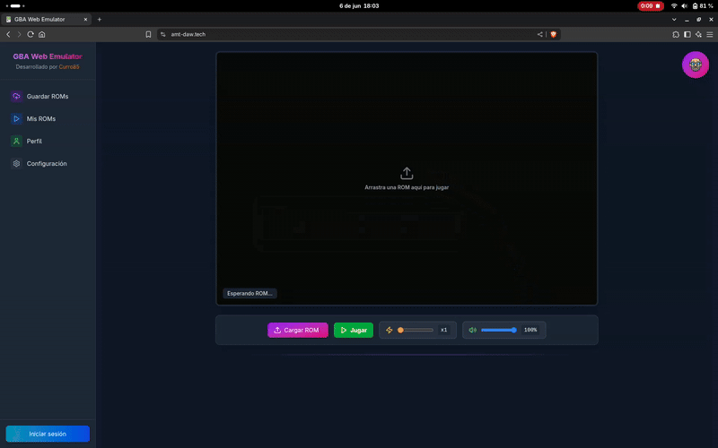
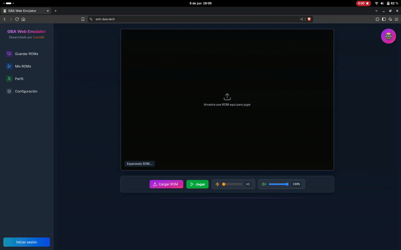
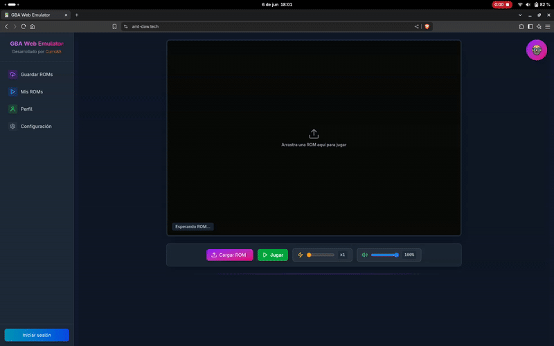
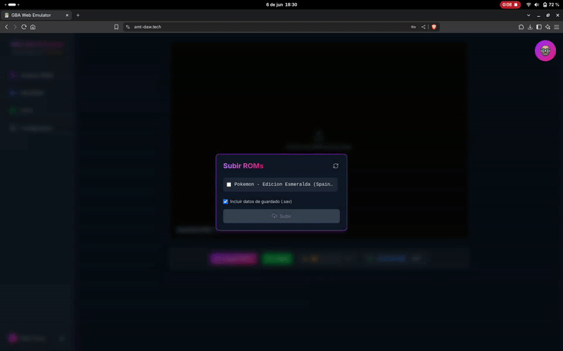
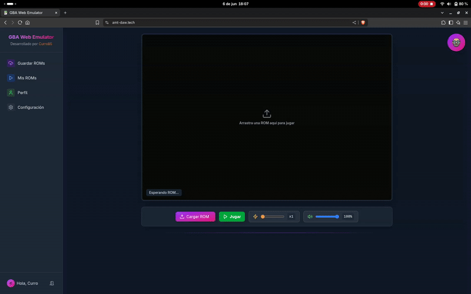

# Emulador GBA

Es el turno del Emulador, en este apartado se mostrará su funcionalidad y como usarlo para jugar
a nuestros juegos favoritos.

## Interfaz

Lo primero que verás al entrar en la web, será una pantalla como esta

Como verás en la imagen hay varios indicadores numéricos:
> 1.- Boton para cargar las ROMs desde el sistema
>
> 2.- Boton de Play/Pause
>
> 3.- Controlador de velocidad del emulador *(hasta x5!)*
>
> 4.- Controlador de volumen del emulador
>
> 5.- Estado del emulador, que indica si está el juego o no pausado.
>
> 6.- Jeremias, nuestro guía de videojuegos (modelo utilizado: Gemini de Google)
>
> 7.- Navbar vertical con opciones para usuarios registrados.

## Primeros pasos

Una vez familiarizados con la interfaz, vamos a explicar como usar el emulador: 
> Para utilizar el emulador la forma más sencilla es **arrastrando la rom en la pantalla del emulador**, así de
> iniciará y a empezar a jugar.
>
> 
>
> También puedes usar el botón de cargar rom y seleccionar una ROM que tengas descargada en tu sistema.
>
> 
>
> Una vez se inicie el juego, podrás jugar con los controles que se muestran en el modal de configuración, estos
> controles son:
>
> |   GBA   |           Teclado           |   Gamepad   |
> |:-------:|:---------------------------:|:-----------:|
> |    A    |              X              |    X / A    |
> |    B    |              Z              | Círculo / B |
> |    L    |              S              |   L1 / LB   |
> |    R    |              A              |   R1 / RB   |
> |  Start  |            Enter            |    Start    |
> | Select  |            Space            |   Select    |
> | Cruceta | &larr; &uarr; &rarr; &darr; |   Cruceta   |
> 
> Si usas gamepad, aparte hay añadido unos botones con funciones especiales que son los siguientes:
> 
> - **LT / RT** o **L2 / R2**: Bajar y subir la velocidad de emulación.
> - **RS** o **R3**: Reiniciar el emulador con el juego actual. (Por si quieres capturar shinys en pokemon).

## Conoce a Jeremías

Jeremías es nuestro asistente IA para guiarnos en los videojuegos, por si nos atascamos en algún nivel o no sabemos
como ajustar mejor a nuestro personaje en *Golden Sun*, Jeremías estará ahi para ayudarte.

## Sube tus roms para jugar donde quieras

Los usuarios registrados tienen la opción de guardar sus roms y partidas guardadas en la nube, para poder 
acceder a sus juegos desde cualquier lugar.

Para subir una rom es tan sencillo como usar el botón *subir roms* del navbar, y cuando se abra el modal seleccionar 
aquellos juegos que queremos subir y si queremos subir sus datos de guardado o no.

Para jugar a una rom desde la nube es también fácil, simplemente selecciona el botón *mis roms* del navbar, luego
selecciona la rom y selecciona si quieres iniciar una nueva partida o una partida guardada anteriormente.

## ¡Hasta pronto!

Hasta aquí la documentación, en el siguiente apartado estan las conclusiones del proyecto.