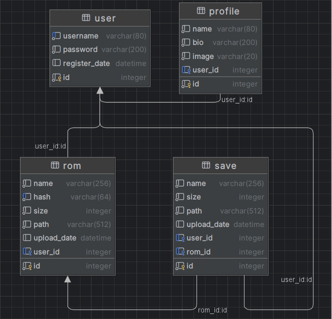

# API: Flask

Vamos a explicar en profundidad la API creada en flask con sus ficheros más importantes
¿Recuerdas la estructura del apartado anterior?

```
gba-api/
|-- docs/
|-- Dockerfile
|-- app.py
|-- config.py
|-- models.py
|-- requirements.txt
|-- utils.py
|-- validators.py
gba-front/
|-- public/
|-- src/
|-- Dockerfile
|-- eslint.config.js
|-- index.html
|-- package-lock.json
|-- package.json
|-- vite.config.js
README.md
docker-compose.yml
```

Vamos a centrarnos ahora en esta parte:

```
gba-api/
|-- docs/
|-- Dockerfile
|-- app.py
|-- config.py
|-- models.py
|-- requirements.txt
|-- utils.py
|-- validators.py
```

## Ficheros y directorios útiles

Estos consisten en el directorio `docs/` y los ficheros `Dockerfile` y `requirements.txt`.

Los ficheros contienen la configuración necesaria para dockerizar la aplicación y desplegar
en AWS a través de actions de github.

El directorio docs contiene los YML necesarios para documentar la API en `Swagger`.

## Validadores y utilidades (`validators.py / utils.py`)

En estos ficheros he creado funciones auxiliares para la aplicación evitando así repetir
código y tener funciones que pueden reutilizarse.

`utils.py`

```python
# Verifica que los ficheros cargados al emulador tengan la extensión correcta
def allowed_file(filename):
    return "." in filename and filename.rsplit(".", 1)[1].lower() in {
        "gba",
        "gbc",
        "gb",
    }


# Crea los directorios del usuario si no existen para almacenar sus juegos
def create_user_directories(user_id):
    base_dir = Config.ROM_FOLDER
    dirs = [
        os.path.join(base_dir, str(user_id)),
        os.path.join(base_dir, str(user_id), "roms"),
        os.path.join(base_dir, str(user_id), "saves"),
    ]

    for directory in dirs:
        os.makedirs(directory, exist_ok=True)
```

`validators.py`

```python
# Validación general de contraseña para que cumpla con los estándares actuales
def validate_password(password):
    if len(password) < 8:
        return "La contraseña debe tener al menos 8 caractéres."
    if not any(char.isupper() for char in password):
        return "La contraseña debe incluir al menos una letra mayúscula."
    if not any(char.islower() for char in password):
        return "La contraseña debe incluir al menos una letra minúscula."
    if not any(char.isdigit() for char in password):
        return "La contraseña debe incluir al menos un número."
    if not any(char in string.punctuation for char in password):
        return "La contraseña debe incluir al menos un carácter especial."
    return None
```

## Modelos de base de datos (`models.py`)

Aquí están los modelos usados en la aplicación con el ORM `SQLAlchemy`, he añadido índices a
los campos más accedidos para así tener mayor velocidad en las peticiones.



```python
class User(db.Model):
    id = db.Column(db.Integer, primary_key=True)
    username = db.Column(db.String(80), unique=True, nullable=False)
    password = db.Column(db.String(200), nullable=False)
    register_date = db.Column(db.DateTime, default=datetime.now)
    profile = db.relationship(
        "Profile", uselist=False, back_populates="user", cascade="all, delete-orphan"
    )
    roms = db.relationship("Rom", back_populates="user", cascade="all, delete-orphan")
    saves = db.relationship("Save", back_populates="user", cascade="all, delete-orphan")


class Profile(db.Model):
    id = db.Column(db.Integer, primary_key=True)
    name = db.Column(db.String(80), nullable=False)
    bio = db.Column(db.String(200), nullable=False)
    image = db.Column(db.String(255), nullable=False, default="default.jpg")
    user_id = db.Column(db.Integer, db.ForeignKey("user.id"), index=True)
    user = db.relationship("User", back_populates="profile")


class Rom(db.Model):
    id = db.Column(db.Integer, primary_key=True)
    name = db.Column(db.String(256), nullable=False)
    hash = db.Column(db.String(64), nullable=False, index=True)
    size = db.Column(db.Integer, nullable=False)
    path = db.Column(db.String(512), nullable=False)
    upload_date = db.Column(db.DateTime, default=datetime.now)
    user_id = db.Column(db.Integer, db.ForeignKey("user.id"), index=True)
    user = db.relationship("User", back_populates="roms")
    saves = db.relationship("Save", back_populates="rom")


class Save(db.Model):
    id = db.Column(db.Integer, primary_key=True)
    name = db.Column(db.String(256), nullable=False)
    size = db.Column(db.Integer, nullable=False)
    path = db.Column(db.String(512), nullable=False)
    upload_date = db.Column(db.DateTime, default=datetime.now)
    user_id = db.Column(db.Integer, db.ForeignKey("user.id"), index=True)
    rom_id = db.Column(db.Integer, db.ForeignKey("rom.id"), index=True)
    user = db.relationship("User", back_populates="saves")
    rom = db.relationship("Rom", back_populates="saves")
```

## Configuración (`config.py`)

En este fichero tengo la configuración de la aplicación como la `SECRET_KEY`, protegidas
por variables de entorno para más seguridad.

```python
class Config:
    JWT_SECRET_KEY = os.getenv("JWT_SECRET_KEY")
    JWT_TOKEN_LOCATION = ["cookies"]
    JWT_COOKIE_HTTPONLY = True
    JWT_COOKIE_SECURE = True
    JWT_COOKIE_SAMESITE = "Lax"
    JWT_ACCESS_TOKEN_EXPIRES = timedelta(hours=1)
    JWT_COOKIE_DOMAIN = os.getenv("JWT_COOKIE_DOMAIN")
    SQLALCHEMY_DATABASE_URI = os.getenv("DB_URL")
    SQLALCHEMY_TRACK_MODIFICATIONS = False
    ROM_FOLDER = os.path.join(os.getcwd(), "uploads", "users")
    GEMINI_API_KEY = os.getenv("GEMINI_API_KEY")
```

## API (`app.py`)

En este fichero están todos los endpoints de la API, en la siguiente tabla se muestra un resumen de cada uno, si quiere
ver el código, cada endpoint tiene un enlace a su respectiva línea dentro del código.

|                                                  Endpoint                                                  | Método |              Parámetros               |             Return              |
|:----------------------------------------------------------------------------------------------------------:|:------:|:-------------------------------------:|:-------------------------------:|
|             [/gemini](https://github.com/Curro85/GBA-WebEmulator/blob/main/gba-api/app.py#L61)             |  POST  |      String: mensaje del usuario      |   String: respuesta de la IA    |
|          [/api/register](https://github.com/Curro85/GBA-WebEmulator/blob/main/gba-api/app.py#L95)          |  POST  | String: usuario<br/>String:Contraseña |   String: Usuario registrado    |
|           [/api/login](https://github.com/Curro85/GBA-WebEmulator/blob/main/gba-api/app.py#L131)           |  POST  | String: usuario<br/>String:contraseña |      String: Login exitoso      |
|          [/api/logout](https://github.com/Curro85/GBA-WebEmulator/blob/main/gba-api/app.py#L147)           |  POST  |                   -                   |                -                |
|          [/api/profile](https://github.com/Curro85/GBA-WebEmulator/blob/main/gba-api/app.py#L163)          |  GET   |               Token JWT               |     JSON: Datos del usuario     |
|        [/api/uploadroms](https://github.com/Curro85/GBA-WebEmulator/blob/main/gba-api/app.py#L231)         |  POST  |     Token JWT<br/>ROMs<br/>Saves      |      String: ROMs subidos       |
|         [/api/loadroms](https://github.com/Curro85/GBA-WebEmulator/blob/main/gba-api/app.py#L333)          |  GET   |               Token JWT               | JSON: Lista de ROMs del usuario |
|  [/api/loadrom/string:rom_hash](https://github.com/Curro85/GBA-WebEmulator/blob/main/gba-api/app.py#L353)  |  GET   | Token JWT<br/>String: Hash de la ROM  |        ROM seleccionada         |
| [/api/deleterom/string:rom_hash](https://github.com/Curro85/GBA-WebEmulator/blob/main/gba-api/app.py#L385) | DELETE | Token JWT<br/>String: Hash de la ROM  |      String: ROM eliminada      |
| [/api/loadsaves/string:rom_hash](https://github.com/Curro85/GBA-WebEmulator/blob/main/gba-api/app.py#L417) |  GET   | Token JWT<br/>String: Hash de la ROM  | JSON: 3 últimos Saves de la ROM |
|   [/api/loadsave/int:save_id](https://github.com/Curro85/GBA-WebEmulator/blob/main/gba-api/app.py#L447)    |  GET   |    Token JWT<br/>Int: ID del Save     |        Save seleccionado        |

En el siguiente apartado explicaremos más sobre el Frontend.
